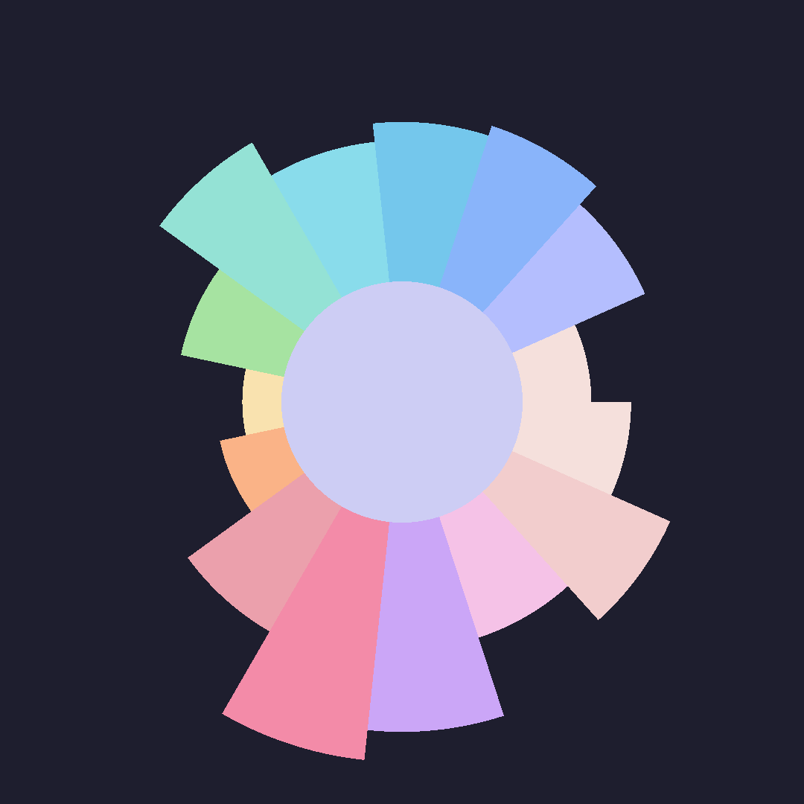

<h1 align="center"> ywp </h1>
<div align="center" border-radius="20px">
    
</div>

*`ywp` is a lightweight wallpaper-based music visualizer designed to integrate the power of [cava](https://github.com/karlstav/cava) with the [Wayland Layer Shell Protocol](https://wayland.app/protocols/wlr-layer-shell-unstable-v1).*

## Philosophy

`cava` is a powerful piece of software that supports a variety of audio backends. It dynamically captures audio waveforms in real time, applies FFT via [FFTW](https://fftw.org), and exposes the processed data for visualization. It even has SDL support for shader-based rendering.

However, for my purposes, I wanted the visualizer to run directly in the background of my Wayland compositor (Hyprland), and setting this up cleanly is not straightforward.

Hyprland does provide ways to set windows as your background—such as [`hyprwinwrap`](https://github.com/hyprwm/hyprland-plugins/tree/main/hyprwinwrap). While it works well for turning arbitrary windows into wallpapers, it usually consumes more resources than necessary for something as simple as a visualizer.

Another option is to rely on your desktop environment’s tools. In my case, that was [Quickshell](https://quickshell.org/), which is built on top of [QtQuick](https://doc.qt.io/qt-6/qtquick-index.html). You *can* build a simple music visualizer using [QtQuick’s shader system](https://doc.qt.io/qt-6/qshader.html) or other elements in the API (see [Appendix A](#appendix-a)). However, there are two major issues with this approach:

1. Shader Buffer Objects (SBOs) cannot be passed, and uniform arrays are not supported—meaning neither dynamic nor static arrays are available.
2. Communication with `cava` relies on parsing raw output, which is unreliable and unnecessarily inefficient.

Other projects, such as [astal](https://aylur.github.io/astal/), integrate `cava` as a library and expose it as a service (`astal-cava`). But since I’m not using `astal` as my compositor, that solution does not fit my setup well.

The goal of this project is therefore to provide a minimal, performant, compositor-agnostic (Wayland for now; see [Roadmap](#roadmap)) background music visualizer that anyone can easily integrate into their system.

## Installation

### Nix

If you're using the [Nix](https://nixos.org/) package manager, you can run the project with:

```sh
nix run github:yunusey/ywp
```

### Other Distributions

`ywp` runs exclusively on Linux. You will need the following dependencies:

* `libffi`
* `libGLU`
* `egl-wayland`
* `libxkbcommon`
* `fftw`
* `pulseaudio`
* `xxd` (required only when compiling from source; not needed when running the binary—see [Shaders](#shaders))

If you want to use an audio backend other than PulseAudio, you may run into issues for now. The audio libraries are linked at compile time, and I have not yet implemented full support for alternatives. You *can* try compiling with the appropriate flags (e.g., `-DCAVA_INPUT_ALSA=ON`)—it may or may not work. I plan to add and test support for additional backends soon.

## Shaders

Shaders are located in the [`./shaders`](./shaders) directory. At compile time, `cmake` runs `xxd` on all shader files in this directory, producing variables of the form:

* `unsigned char shaders_{name}_{type}[]`
* `unsigned char shaders_{name}_{type}_len`

For example: `shaders_spline_frag` and `shaders_spline_frag_len`.

These variables are declared as `extern` in [`src/shader.h`](./src/shader.h) and included in [`src/shader.c`](./src/shader.c) so that they are correctly linked at build time.

Currently, `ywp` does not support loading shaders at runtime—but this is a feature I’d like to add in the future.

## Roadmap

* [ ] X11 support
* [ ] Support for ALSA, FIFO, and other Linux audio backends
* [ ] Mouse and keyboard interactions
* [ ] Multi-monitor support

> [!WARNING]
> The Wayland Layer Shell Protocol is feature-rich. While `ywp` currently does not support input handling, the protocol *does* allow both mouse and keyboard interaction. Mouse input should be relatively easy to integrate; keyboard input is considerably trickier and adds unnecessary complexity at this stage.
>
> If you want keyboard input in your own layer-shell-based project, I recommend taking a look at [my Raylib fork](https://github.com/yunusey/raylib), which adds `wlrlayer` as a Raylib platform. It works well, but the complexity is outside the scope of `ywp`, so it's not included by default. I plan to include an example demonstrating how to use Raylib to draw surfaces via Layer Shell in the future.

## Appendix A

To begin, create a [`Singleton`](https://quickshell.org/docs/v0.2.0/types/Quickshell/Singleton/) that communicates with `cava`:

```qml
pragma Singleton

import qs.config
import Quickshell
import Quickshell.Io
import QtQuick

Singleton {
    id: root

    property list<int> values: Array(Appearance.cava.visualizerBars)

    Process {
        id: cavaProc

        running: Appearance.cava.enabled
        command: ["sh", "-c", `printf '[general]\nframerate=${Appearance.cava.frameRate}\nwidth=100\nbars=${Appearance.cava.visualizerBars}\nsleep_timer=3\n[output]\nchannels=mono\nmethod=raw\nraw_target=/dev/stdout\ndata_format=ascii\nascii_max_range=100' | cava -p /dev/stdin`]
        stdout: SplitParser {
            onRead: data => {
                root.values = data.slice(0, -1).split(";").map(v => parseInt(v, 10));
            }
        }
    }
}
```

Next, use the `values` from this `Singleton` in your QML widget. One possible implementation is:

```qml
pragma ComponentBehavior: Bound

import qs.widgets
import qs.config
import qs.services
import Quickshell
import QtQuick
import QtQuick
import QtQuick.Shapes

Item {
    id: root
    property bool enabled: false
    readonly property list<int> values: Cava.values
    visible: root.enabled
    anchors.fill: parent
    Variants {
        id: visualizer
        model: Array.from({
            length: root.enabled ? Cava.values.length : 0
        }, (_, i) => i)
        delegate: PathCurve {
            required property int modelData
            property int index: modelData
            property int value: Math.min(Math.max(0, Cava.values[index]), 100)
            x: index / (Cava.values.length - 1) * root.width
            y: root.height * (1. - value / 100.)
        }
    }
    PathLine {
        id: path_start
        x: 0
        y: visualizer.instances[0].y
    }
    PathLine {
        id: path_end
        x: root.width
        y: root.height
    }
    Shape {
        id: shape
        preferredRendererType: Shape.GeometryRenderer
        ShapePath {
            id: path_curves
            strokeColor: Colors.palette.text
            strokeWidth: 5
            capStyle: ShapePath.FlatCap
            joinStyle: ShapePath.MiterJoin
            startX: 0
            startY: root.height
            fillColor: Qt.alpha(Colors.palette[Colors.flavour], 0.2)
            pathElements: [path_start, ...visualizer.instances, path_end]
        }
    }
}
```

This produces an effect visually similar to the [`spline`](./shaders/spline.frag) shader.

> [!CAUTION]
> My setup includes a custom `qs.config` file with an `Appearance` dictionary containing `visualizerBars` and `frameRate`. Replace these with appropriate values for your configuration.

## References

* [cava](https://github.com/karlstav/cava)
* [The Wayland Protocol](https://wayland-book.com/)
* [FFTW](https://fftw.org/)
* [QtQuick](https://doc.qt.io/qt-6/qtquick-index.html)
* [Nix](https://nixos.org/)
* [Quickshell](https://quickshell.org/docs/v0.2.0/types/Quickshell/Singleton/)
* [astal](https://aylur.github.io/astal/)
